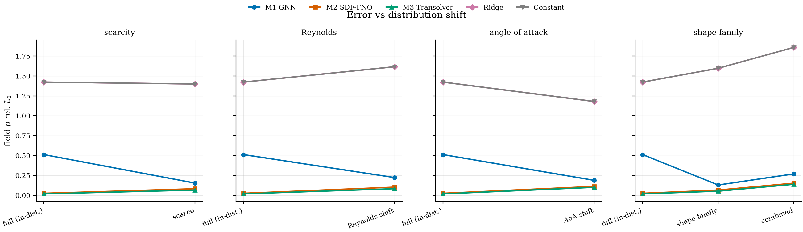
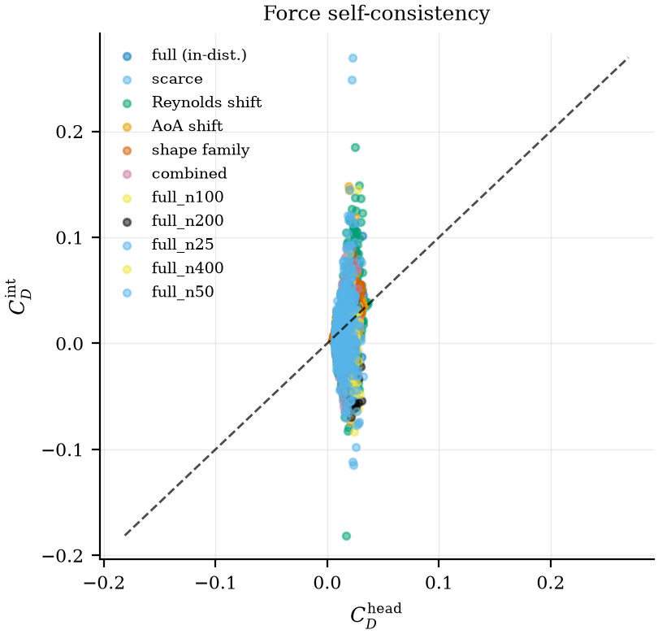
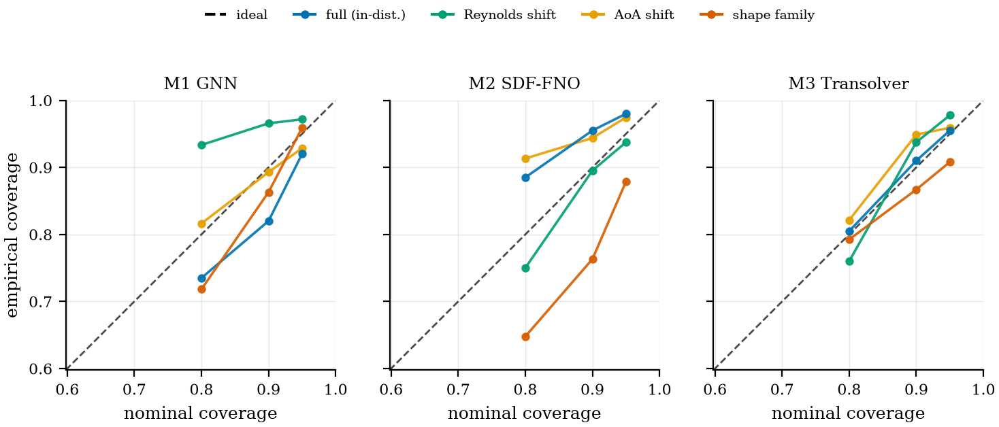
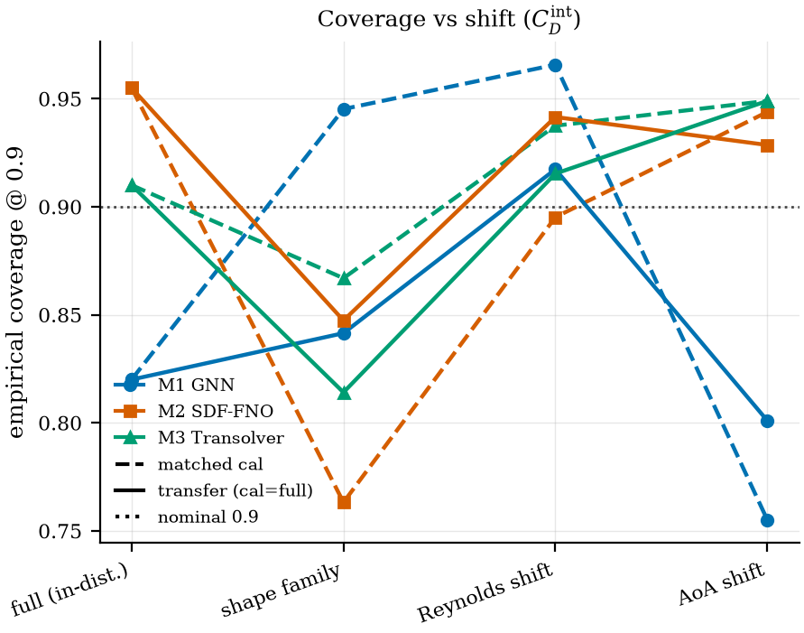
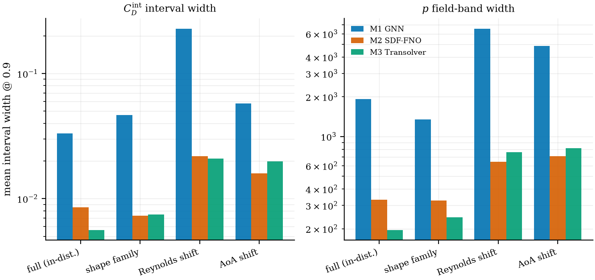
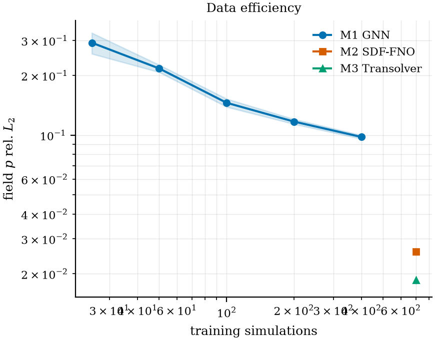
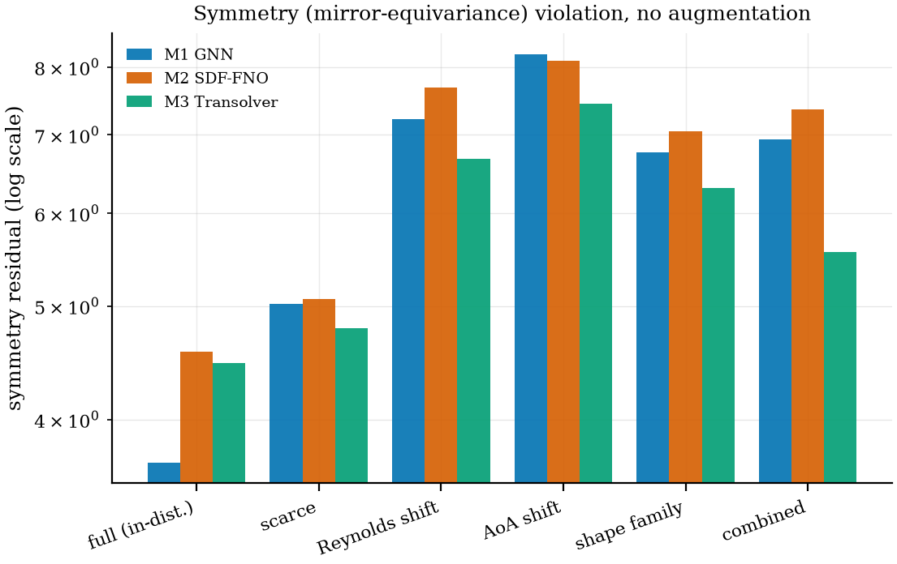
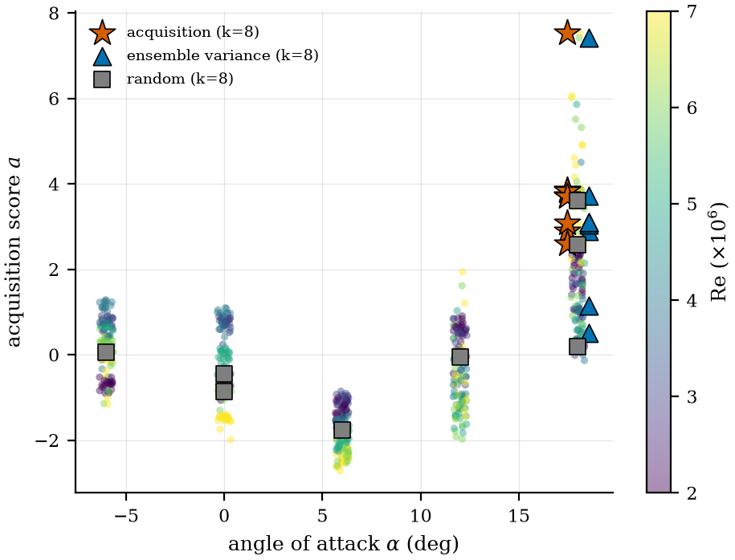
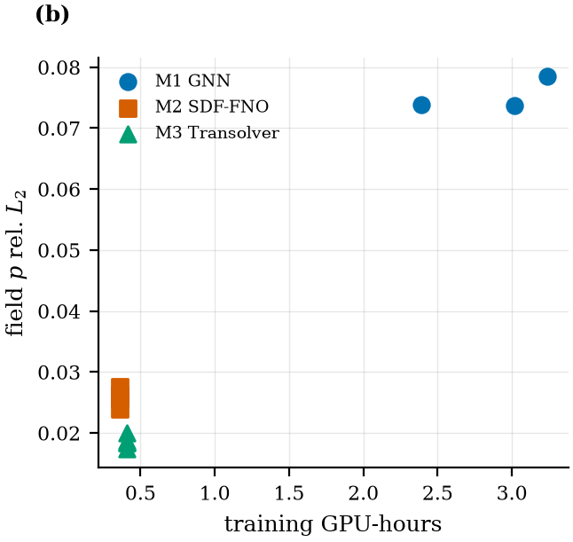

# RESULTS_AUTO — machine-generated results digest

Auto-generated 2026-09-03 by `scripts/make_results_digest.py` (regenerated automatically as new runs land). For interpretation see [RESULTS.md](RESULTS.md); for concepts see [OVERVIEW.md](OVERVIEW.md).

## Run inventory (76 runs with metrics)

```
constant_aoa_s0
constant_combined_s0
constant_full_s0
constant_reynolds_s0
constant_scarce_s0
constant_shape5_s0
gnn_aoa_s0
gnn_combined_s0
gnn_full_n100_s0
gnn_full_n100_s1
gnn_full_n100_s2
gnn_full_n200_s0
gnn_full_n200_s1
gnn_full_n200_s2
gnn_full_n25_s0
gnn_full_n25_s1
gnn_full_n25_s2
gnn_full_n400_s0
gnn_full_n400_s1
gnn_full_n50_s0
gnn_full_n50_s1
gnn_full_n50_s2
gnn_full_s0
gnn_reynolds_s0
gnn_scarce_s0
gnn_shape5_s0
ridge_aoa_s0
ridge_combined_s0
ridge_full_s0
ridge_reynolds_s0
ridge_scarce_s0
ridge_shape5_s0
sdf_fno_aoa_s0
sdf_fno_aoa_s1
sdf_fno_aoa_s2
sdf_fno_aoa_s3
sdf_fno_aoa_s4
sdf_fno_combined_s0
sdf_fno_full_s0
sdf_fno_full_s1
sdf_fno_full_s2
sdf_fno_full_s3
sdf_fno_full_s4
sdf_fno_reynolds_s0
sdf_fno_reynolds_s1
sdf_fno_reynolds_s2
sdf_fno_reynolds_s3
sdf_fno_reynolds_s4
sdf_fno_scarce_s0
sdf_fno_shape5_s0
sdf_fno_shape5_s1
sdf_fno_shape5_s2
sdf_fno_shape5_s3
sdf_fno_shape5_s4
transolver_aoa_s0
transolver_aoa_s1
transolver_aoa_s2
transolver_aoa_s3
transolver_aoa_s4
transolver_combined_s0
transolver_full_s0
transolver_full_s1
transolver_full_s2
transolver_full_s3
transolver_full_s4
transolver_reynolds_s0
transolver_reynolds_s1
transolver_reynolds_s2
transolver_reynolds_s3
transolver_reynolds_s4
transolver_scarce_s0
transolver_shape5_s0
transolver_shape5_s1
transolver_shape5_s2
transolver_shape5_s3
transolver_shape5_s4
```

## Core metric grids (seed 0, 3 models x 6 splits)

### Field pressure rel-L2 (lower=better)

| model | full | scarce | reynolds | aoa | shape5 | combined |
| --- | --- | --- | --- | --- | --- | --- |
| M3 Transolver | 0.0174 | 0.0666 | 0.0773 | 0.1085 | 0.0546 | 0.1390 |
| M2 SDF-FNO | 0.0257 | 0.0832 | 0.0979 | 0.1106 | 0.0641 | 0.1534 |
| M1 GNN | 0.0737 | 0.1540 | 0.2234 | 0.1884 | 0.1301 | 0.2697 |

### Field wall-shear rel-L2

| model | full | scarce | reynolds | aoa | shape5 | combined |
| --- | --- | --- | --- | --- | --- | --- |
| M3 Transolver | 0.0182 | 0.0664 | 0.0650 | 0.0668 | 0.0450 | 0.1076 |
| M2 SDF-FNO | 0.0306 | 0.0882 | 0.1013 | 0.0840 | 0.0583 | 0.1430 |
| M1 GNN | 0.0681 | 0.1333 | 0.1832 | 0.1516 | 0.1137 | 0.2358 |

### C_D head MAE

| model | full | scarce | reynolds | aoa | shape5 | combined |
| --- | --- | --- | --- | --- | --- | --- |
| M3 Transolver | 0.00012 | 0.00032 | 0.00048 | 0.00117 | 0.00031 | 0.00060 |
| M2 SDF-FNO | 0.00014 | 0.00039 | 0.00060 | 0.00087 | 0.00032 | 0.00080 |
| M1 GNN | 0.00012 | 0.00031 | 0.00068 | 0.00109 | 0.00032 | 0.00066 |

### C_D ranking Spearman (higher=better)

| model | full | scarce | reynolds | aoa | shape5 | combined |
| --- | --- | --- | --- | --- | --- | --- |
| M3 Transolver | 0.999 | 0.996 | 0.976 | 0.947 | 0.983 | 0.972 |
| M2 SDF-FNO | 0.999 | 0.992 | 0.982 | 0.955 | 0.984 | 0.968 |
| M1 GNN | 0.999 | 0.996 | 0.977 | 0.945 | 0.983 | 0.969 |

### Force self-consistency FSC_cd (lower=better)

| model | full | scarce | reynolds | aoa | shape5 | combined |
| --- | --- | --- | --- | --- | --- | --- |
| M3 Transolver | 0.0011 | 0.0039 | 0.0061 | 0.0043 | 0.0019 | 0.0086 |
| M2 SDF-FNO | 0.0017 | 0.0052 | 0.0052 | 0.0034 | 0.0022 | 0.0086 |
| M1 GNN | 0.0053 | 0.0086 | 0.0164 | 0.0104 | 0.0089 | 0.0176 |

### Symmetry residual

| model | full | scarce | reynolds | aoa | shape5 | combined |
| --- | --- | --- | --- | --- | --- | --- |
| M3 Transolver | 4.44 | 4.78 | 7.17 | 7.51 | 6.26 | 5.56 |
| M2 SDF-FNO | 4.67 | 5.07 | 7.82 | 8.18 | 6.86 | 7.36 |
| M1 GNN | 4.49 | 5.02 | 7.22 | 8.21 | 6.76 | 7.42 |

## Generated tables

### Table 1 — in-distribution accuracy/consistency/cost

| model | $p$ rel-$L_2$ | $\tau_w$ rel-$L_2$ | $C_D$ MAE | $C_D$ $\rho$ | FSC $C_D$ | sym | GPU-h |
| --- | --- | --- | --- | --- | --- | --- | --- |
| M1 GNN | 0.0737 | 0.0681 | **0.00012** | **0.999** | 0.0053 | 4.49 | 3.02 |
| M2 SDF-FNO | 0.0259 | 0.0307 | 0.000142 | 0.998 | 0.00162 | 4.51 | 0.36 |
| M3 Transolver | **0.0186** | **0.0192** | 0.000135 | 0.999 | **0.00129** | 4.47 | 0.408 |
| Ridge | 1.42 | 1.16 | 0.0016 | 0.902 | 0.00604 | **0** | **0** |
| Constant | 1.42 | 1.16 | 0.00342 | -- | 0.0063 | **0** | **0** |

### Table 2 — OOD field error by split

| model | full (in-dist.) | scarce | Reynolds shift | AoA shift | shape family | combined | full_n100 | full_n200 | full_n25 | full_n400 | full_n50 |
| --- | --- | --- | --- | --- | --- | --- | --- | --- | --- | --- | --- |
| M1 GNN | 0.0737 | 0.154 | 0.223 | 0.188 | 0.13 | 0.27 | **0.146** | **0.117** | **0.292** | **0.0979** | **0.217** |
| M2 SDF-FNO | 0.0259 | 0.0832 | 0.104 | 0.113 | 0.0665 | 0.153 | -- | -- | -- | -- | -- |
| M3 Transolver | **0.0186** | **0.0666** | **0.0837** | **0.101** | **0.0526** | **0.139** | -- | -- | -- | -- | -- |
| Ridge | 1.42 | 1.4 | 1.62 | 1.18 | 1.6 | 1.86 | -- | -- | -- | -- | -- |
| Constant | 1.42 | 1.4 | 1.62 | 1.18 | 1.6 | 1.86 | -- | -- | -- | -- | -- |

### Table 3 — calibration coverage/width

| model | split | cov@.8 | cov@.9 | cov@.95 | cov@.9 (tr) | width@.9 | ECE |
| --- | --- | --- | --- | --- | --- | --- | --- |
| M1 GNN | full (in-dist.) | 0.755 | 0.845 | 0.915 | 0.845 | 0.0445 | 0.045 |
| M1 GNN | shape family | 0.755 | 0.945 | 0.965 | 0.841 | 0.0537 | 0.0349 |
| M1 GNN | Reynolds shift | 0.504 | 0.698 | 0.806 | 0.825 | 0.0346 | 0.214 |
| M1 GNN | AoA shift | 0.689 | 0.791 | 0.908 | 0.791 | 0.0329 | 0.0874 |
| M2 SDF-FNO | full (in-dist.) | 0.885 | 0.955 | 0.98 | 0.955 | 0.00854 | 0.0567 |
| M2 SDF-FNO | shape family | 0.648 | 0.763 | 0.879 | 0.847 | 0.00731 | 0.12 |
| M2 SDF-FNO | Reynolds shift | 0.75 | 0.895 | 0.938 | 0.942 | 0.0218 | 0.0224 |
| M2 SDF-FNO | AoA shift | 0.913 | 0.944 | 0.974 | 0.929 | 0.0159 | 0.0605 |
| M3 Transolver | full (in-dist.) | 0.805 | 0.91 | 0.955 | 0.91 | 0.00562 | 0.00667 |
| M3 Transolver | shape family | 0.793 | 0.867 | 0.908 | 0.814 | 0.00746 | 0.0275 |
| M3 Transolver | Reynolds shift | 0.76 | 0.938 | 0.978 | 0.915 | 0.021 | 0.0351 |
| M3 Transolver | AoA shift | 0.821 | 0.949 | 0.959 | 0.949 | 0.0198 | 0.0265 |

## Figure gallery

All figures are in `paper/figures/` (PDF + PNG). Present now:

### fig04: Field error vs distribution shift (centerpiece)



### fig05: Force self-consistency scatter (C_D int vs head)



### fig06: Reliability diagram (empirical vs nominal coverage)



### fig07: Coverage vs distribution shift



### fig08: Interval width, in-distribution vs OOD



### fig09: Data-efficiency curves (rel-L2 vs train size)



### fig10: Symmetry residual per model



### fig11: Active-learning pool / selections



### fig12: Cost vs accuracy (Pareto)



